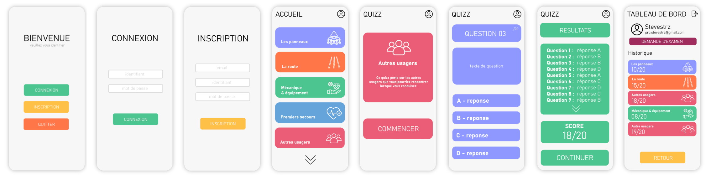

# OnTheRoad Andoid Application - Traffic rules Quiz

#### We followed this model which was created by us


#### You can clone it with :
```sh
git clone https://github.com/spritrl/OnTheRoad
```

#### If you want to setup the server on your machine :
You need to change the IP address on :
- https://github.com/spritrl/OnTheRoad/blob/main/app/src/main/java/fr/uca/info/ontheroad/Register.java
- https://github.com/spritrl/OnTheRoad/blob/main/app/src/main/java/fr/uca/info/ontheroad/Login.java

Don't put localhost:8080 or 127.0.0.1:8080 because it will look for these IP addresses in the emulator.\
You must put your local IP address or the server IP address.

### Student Repo
- STRAZZERI Steve - https://github.com/steve-strz
- REALINI Christophe - https://github.com/spritrl